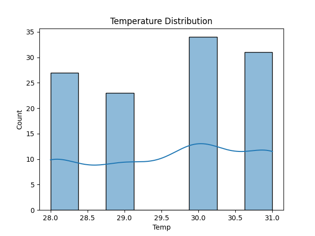
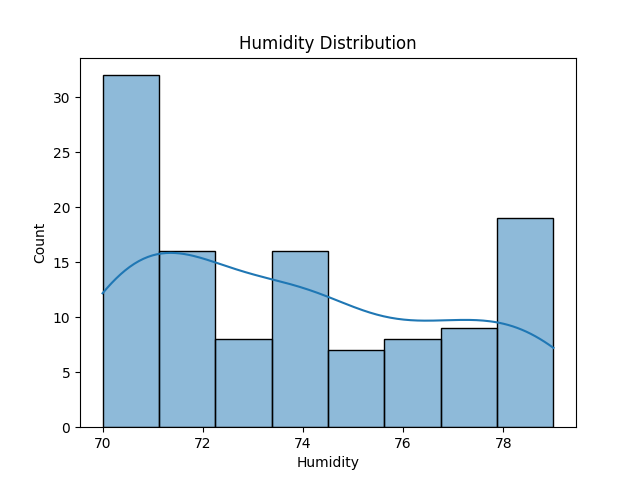
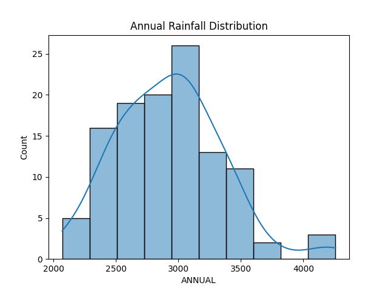
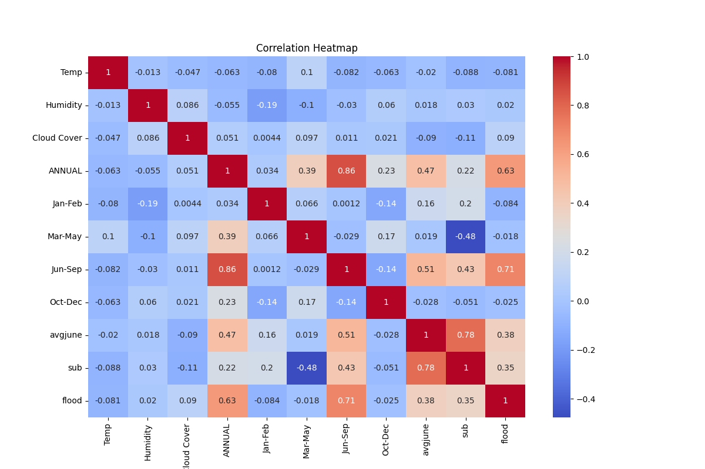
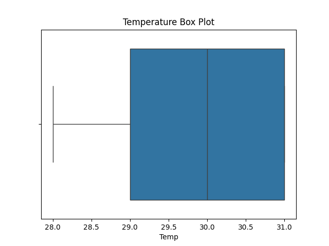
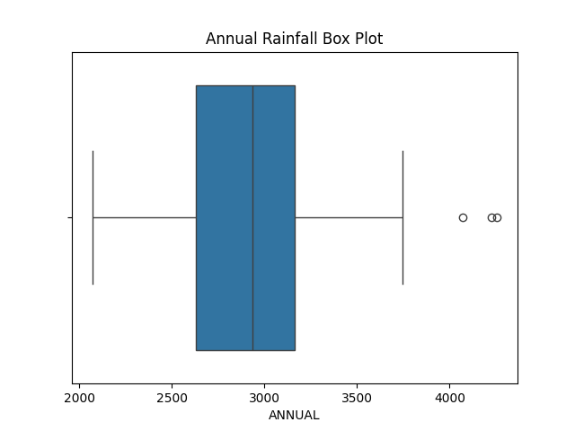

# 🌊 Rising Waters - Flood Prediction System

## 📌 Project Overview
Rising Waters is a Machine Learning based web application that predicts flood risk based on weather and rainfall conditions.  
It uses a trained ML model integrated with a Flask web framework to provide real-time predictions through a simple web interface.

---
## 📊 Dataset
The model was trained using a weather and rainfall dataset containing historical flood-related parameters.

---

## 🚀 Features
- 🌡 Predict flood risk using weather inputs
- 📊 Displays Flood Risk result (Safe / Flood)
- 🌊 Clean and responsive UI design
- 🔵 Blue themed modern interface
- ⚡ Real-time prediction using ML model
- 📈 Machine Learning based prediction system

---

## 🛠 Technologies Used
- Python 🐍
- Flask 🌐
- Scikit-learn 🤖
- Pandas 📊
- NumPy
- HTML, CSS 🎨
- Joblib (Model saving & loading)

---

## 📂 Project Structure

```text
Rising-Waters/
│
├── app.py
├── train_model.py
├── floods.save
├── transform.save
├── requirements.txt
├── Procfile
├── ER_diagram.png
│
├── templates/
│   ├── home.html
│   ├── index.html
│   ├── chance.html
│   ├── no_chance.html
│
├── static/
│   └── style.css
│
└── dataset/
```

## 📊 Data Visualization (EDA Results)

### 🌡 Temperature Distribution


### 💧 Humidity Distribution


### 🌧 Annual Rainfall Distribution


### 📊 Correlation Heatmap


### 📦 Boxplot Analysis



## 🌐 Live Demo
👉 https://rising-waters-xzyj.onrender.com
---

## 🚀 How to Run Locally

### 1️⃣ Clone Repository
```bash
git clone https://github.com/Ishrath06/Rising-Waters.git


2️⃣ Move into folder
cd Rising-Waters


3️⃣ Install dependencies
pip install -r requirements.txt


4️⃣ Run Flask app
python app.py

5️⃣ Open in browser
http://127.0.0.1:5000/

```
👨‍💻 Team Members
Shaik Ishrath (Team Lead)
Battu Chakradhar Raju (Member)
Kannari Meghana (Member)
Kenchugundu Venkatesh (Member)
Syed Abdul Irfan (Member)

---
